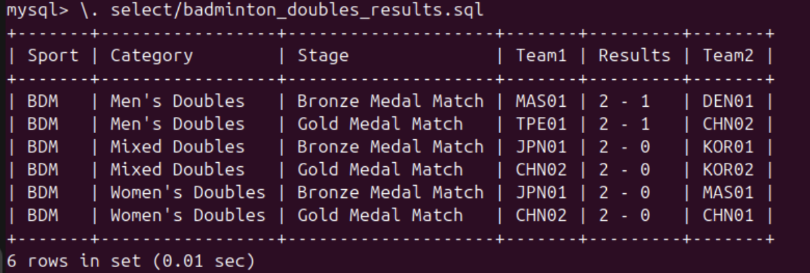
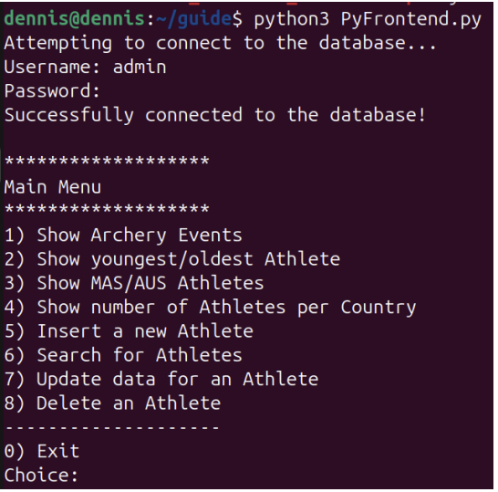
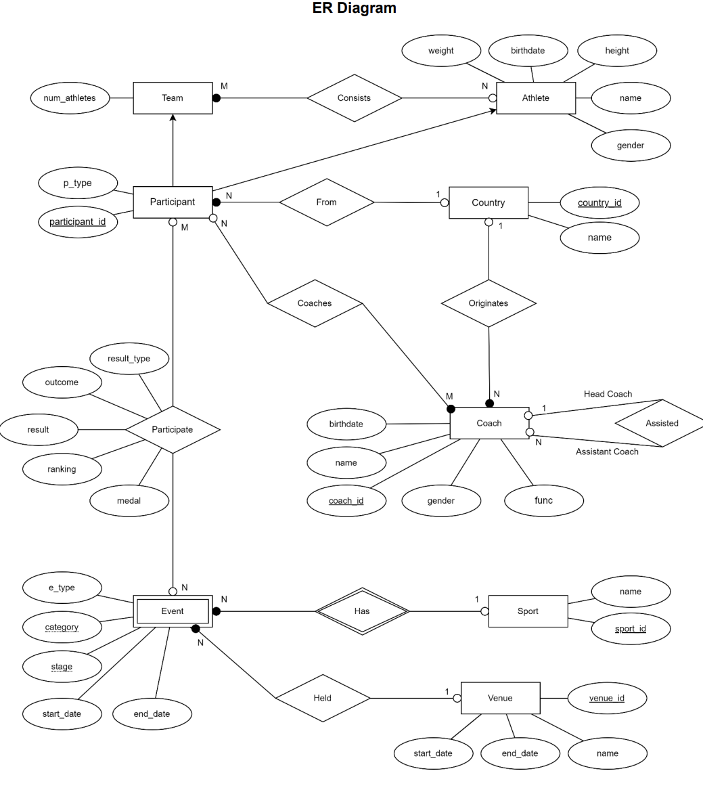

# paris-2024-db
MySQL database based on https://www.kaggle.com/datasets/piterfm/paris-2024-olympic-summer-games. This database models the Paris 2024 Olympics, primarily focusing on the results of the games.
The database uses MySQL 8.0.39+ and is meant for use on Linux.

Run `\. rebuild.sql` to create the database and all of its contents. There are various predefined SQL queries within their respective subdirectories that you can run. There is also a CLI Python frontend that can be accessed by running `python3 PyFrontend.py`.

Examples:

The design of the database is as follows:

